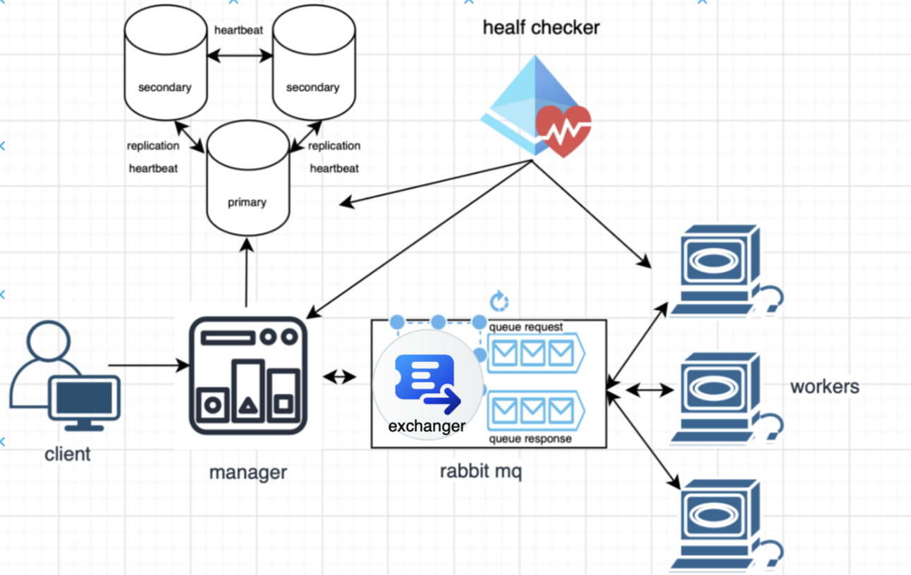

# Проект CrackHash — распределённая система для подбора MD5-хэшей

**CrackHash** — это распределённая система для подбора MD5-хэшей с использованием подхода brute-force.  
Система состоит из двух основных компонентов: **менеджера** и **воркеров**, взаимодействующих между собой по сети и через очередь сообщений.
---

## 🧠 Общая логика работы

1. Пользователь отправляет менеджеру хэш и максимальную длину исходного слова.
2. Менеджер разбивает задачу на части, соответствующие количеству воркеров.
3. Каждая часть отправляется одному воркеру для перебора комбинаций в определённом диапазоне.
4. Воркеры возвращают найденные совпадения (если есть) обратно менеджеру.
5. Менеджер собирает результаты и возвращает клиенту ответ.

---

## 📦 Task 1: Services Implementation

### Формат обмена

1. **Отправка задач**:
    - **POST** `/internal/api/worker/hash/crack/task`

2. **Ответ от воркера**:
    - **PATCH** `/internal/api/manager/hash/crack/request`

Используется **RestTemplate** для взаимодействия.

### Генерация моделей из XSD-схем (JAXB)

Модели генерируются из XSD-схем с использованием **JAXB**.

### Состояние запросов

1. Хранятся в оперативной памяти.
2. Используются потокобезопасные коллекции.
3. Статусы:
    - `IN_PROGRESS`
    - `READY`
    - `ERROR`

### Воркеры

1. Обрабатывают диапазон комбинаций слов, не храня весь набор в памяти.
2. Используется библиотека **combinatoricslib3**.
3. Деление диапазона производится на основе **PartNumber** и **PartCount**.
4. Менеджер равномерно распределяет нагрузку между воркерами.

## Task 2: Fault Tolerance

В рамках второй лабораторной работы необходимо модифицировать систему таким образом, чтобы обеспечить гарантированную обработку запроса пользователя (если доступен менеджер) и обеспечить отказоустойчивость системы в целом.

### Основные требования

1. **Обеспечение сохранности данных при отказе работы менеджера**:
    - Задачи должны сохраняться в базе данных.
    - Менеджер должен гарантировать, что задача принята в работу только после успешной записи и репликации в **MongoDB**.

2. **Взаимодействие воркеров с менеджером через очередь RabbitMQ**:
    - Настроить очередь с **direct exchange**.
    - Если менеджер недоступен, сообщения должны сохраняться в очереди до восстановления работы менеджера.
    - Используется **docker-compose** для размещения RabbitMQ.

3. **Обеспечение частичной отказоустойчивости базы данных**:
    - Репликация для **MongoDB**: одна **Primary** нода и две **Secondary** ноды.
    - При падении **Primary** ноды система должна продолжать работу, выбрав новую **Primary** ноду.

4. **Обеспечение сохранности данных при отказе работы воркера**:
    - В **docker-compose** должно быть как минимум 2 воркера.
    - В случае отказа воркера, задача должна быть переотправлена другому воркеру с использованием **acknowledgements** для обработки ошибок.
    - Если на момент создания задачи нет доступных воркеров, сообщения должны ожидать в очереди и затем быть отправлены на исполнение.

5. **Обеспечение сохранности данных при отказе работы очереди**:
    - Если менеджер не может отправить задачи в очередь, они должны быть сохранены в базе данных до восстановления доступности очереди, после чего снова отправлены.
    - Очередь должна поддерживать персистентность сообщений, чтобы они не терялись при рестарте.

### Тестовые кейсы

1. **Стоп сервиса менеджера в docker-compose**:
    - Полученные ранее ответы от воркеров должны быть сохранены в базе данных и не потеряться.
    - Не дошедшие до менеджера ответы на задачи не должны потеряться, менеджер должен подобрать их при рестарте.

2. **Стоп Primary-ноды реплик-сета MongoDB в docker-compose**:
    - Primary-нода должна измениться, система должна продолжить работу в штатном режиме.

3. **Стоп RabbitMQ в docker-compose**:
    - Все необработанные сообщения после рестарта очереди не должны потеряться.

4. **Стоп воркера во время обработки задачи**:
    - Задача должна быть переотправлена другому воркеру, и задача не должна быть потеряна.

---

## Примечания

1. Для отправки и получения сообщений в формате **XML** в очередь рекомендуется использовать **MarshallingMessageConverter** + **Jaxb2Marshaller** в связке с **AmqpTemplate** (для отправки) и **@RabbitListener** (для получения).

2. При рестарте **RabbitMQ** сбрасывает статус отправленных сообщений (персистентных) из **unacked** в **ready**. Поэтому допускается повторная обработка одной задачи двумя воркерами. Это необходимо учитывать в логике менеджера.

---

## Полезные ссылки

- [Spring REST API](https://spring.io/projects/spring-web)
- [XSD схемы](#)
- [XSD спецификация](#)
- [JAXB + Spring](https://www.baeldung.com/jaxb-with-spring-boot)
- [Генерация комбинаций](#)
- [RestTemplate: JAXB + RestTemplate пример](#)
